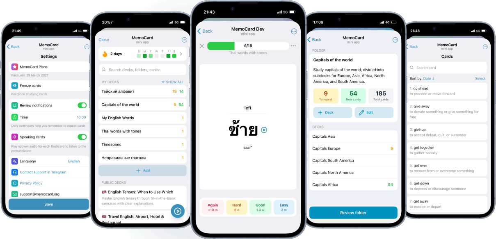

  Readme: <a href="./README.md">English</a>, <a href="./docs/README.ru.md">Русский</a>, <a href="./docs/README.ua.md">Українська</a>, <a href="./docs/README.es.md">Español</a>, <a href="./docs/README.pt-br.md">Português</a>, <a href="./docs/README.ar.md">العربية</a>, <a href="./docs/README.fa.md">فارسی</a>

MemoCard was born because existing apps like Anki are just too clunky. Sure, they're powerful, but they demand endless setup, don't remind you when it matters, and look like they're stuck in the past. During the Telegram Contest, I built the flashcard app I'd been dreaming of. Minimal configuration, smart reminders, works across all platforms with an interface that just makes sense. Under the hood is Ebbinghaus's proven spaced repetition method. Cards pop up exactly when you're starting to forget - that's when your brain learns best. MemoCard won a prize at the contest. Now thousands of people around the world use it to learn better.

Website: [memocard.org](https://memocard.org)

Contest story: https://teletype.in/@alteregor/memocard-telegram-contest-win 

## Features

- 📱 **Cross-Platform** - Works seamlessly on Telegram, Browser, iOS, and Android
- 🗂️ **Organize** - Create unlimited cards, decks, and folders to structure your knowledge
- ⚡ **Create cards fast** - Generate multiple cards at once for efficient deck building. Use AI to generate cards automatically
- 🔔 **Smart notifications** - Receive daily reminders for cards that need review, optimizing your study time
- ✨ **Quality content** - Choose from a catalog of high-quality, pre-made decks
- 🔥 **Streaks and heatmap** - Track your learning consistency and review history
- ⏸️ **Pause when needed** - Freeze cards when you need a break or are too busy
- 🔊 **Text-to-Speech** - Learn foreign words with automatic pronunciation features
- 🎨 **Custom formatting** - Add styling to your cards to emphasize important information
- 🃏 **Different card types** - Use regular cards or cards with pre-made answers to test your knowledge

## Example use cases
- You're a tourist in a new country and want to acquire basic knowledge of the foreign language
- You're a developer looking to recall complex bash commands or programming constructs more effectively
- You're medical student aiming to memorize all the Latin names of muscles
- You're keen on improving your geography skills, aiming to memorize countries, capitals, major cities, mountains, rivers, and other geographical facts
- You're studying music and want to practice the harmony
- You're delving into history and want to retain key historical facts
- You're an English teacher who wants to share your decks with your students

## How it differs from other apps

While there are free applications like Anki available, they come with platform limitations and feature gaps:
- Anki doesn't offer a direct approach for users to privately share decks with friends or colleagues outside of its public shared decks feature. Moreover, sharing a deck demands a switch between the desktop and web versions of Anki. With the Memo Card bot, users can effortlessly share decks directly within Telegram.
- For additional functionality in Anki, users must install plugins, which are limited only to the desktop version. In contrast, the Memo Card bot is accessible on Mac, Windows, iOS, Android, and web versions of Telegram.
- Anki lacks automatic push notifications to alert users of upcoming reviews. It is easy to solve with Telegram push notifications
