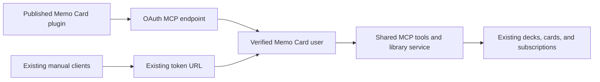

Memo Card public ChatGPT plugin MVP

Research checked on September 9, 2026. Implementation updated September 11, 2026. The OAuth backend and new Telegram website login are deployed to development and production. Directory publication is still pending. Current publication status, deployment versions, reviewer credentials instructions, and executed submission cases are maintained in [the moderation review](chatgpt-moderation-review.md).

Build a Memo Card plugin that lets users turn material from a ChatGPT conversation into flashcards. Save the cards to their existing Memo Card library so they can study in Telegram or the web app. For this first release, submit a remote Model Context Protocol (MCP) server without a custom ChatGPT interface. OpenAI supports this submission type. [Supported submission types](https://developers.openai.com/plugins/deploy/submission)

An independent developer can submit a plugin. OpenAI accepts verified individuals and businesses, and its published requirements set no minimum revenue, user count, paying customers, or social audience. You can use Memo Card as the product name and identify its verified developer as the publisher. Meeting these requirements lets you submit; it does not guarantee approval. [Submission requirements](https://developers.openai.com/plugins/deploy/submission#verify-your-developer-or-business-identity)

Users can find a published plugin by name or open its directory link. A listing does not mean OpenAI endorses the plugin, features it, or recommends it to users. Start by helping existing Memo Card users connect. [Plugin guidelines](https://developers.openai.com/plugins/app-guidelines#purpose-and-originality), [Publication and discovery](https://developers.openai.com/plugins/deploy/app-review#publication-and-distribution)

Users should be able to:

1. Open the published listing from Memo Card or find it by name
2. Connect, sign in with Telegram, and approve access to their Memo Card library
3. Ask ChatGPT to create, improve, or organize cards
4. Use the same connection in later conversations

Memo Card must not require users to sign in again on a schedule or after a long period of inactivity. Keep their account permission active and use rotating refresh tokens that do not expire. Renew short-lived access tokens without showing a login page. The proposed OAuth provider supports refresh tokens and client registrations without expiry. ChatGPT may still drop a connection, and users may need to act after disconnecting or revoking access. The first Telegram login and ChatGPT's confirmations for changes are separate from token renewal. [Provider token lifetimes](https://github.com/cloudflare/workers-oauth-provider/blob/main/docs/advanced-configuration.md#token-and-client-lifetimes)

Most of the library features already exist:

| Existing code | What to do for this release |
| --- | --- |
| [MCP request handler](../packages/api/src/mcp/handle-mcp-request.ts) | Keep `/mcp?token=mcp_…` working with personal URL tokens |
| [MCP server factory](../packages/api/src/mcp/create-mcp-server.ts) | Reuse the ten tools for reading the library, creating folders/decks/cards, editing, moving, and deleting |
| [Library service](../packages/api/src/mcp/library-service.ts) | Reuse ownership checks and data changes; enforce paid access at both MCP entry points |
| [Telegram/browser identity resolution](../packages/api/src/services/get-user.ts) | Connect users to their existing account, subscription, and linked Google identity |
| [Telegram widget validation](../packages/api/src/lib/telegram/validate-telegram-login-widget-data.ts) | Do not use old signed payloads as proof of a new login; the current validator does not check `auth_date` |
| [MCP call logging](../packages/api/src/mcp/log-mcp-tool-calls.ts) | Review which tool arguments need to be logged and disclose how long they are kept |
| [Connection screen](../packages/frontend/src/screens/mcp-settings/mcp-settings-screen.tsx) | Show only the new connection flow and connected apps; manual setup is retired from the UI |

Use two connection routes that share the existing tools:



The development endpoint is `https://api.dev.memocard.org/mcp/chatgpt`; production is `https://api.memocard.org/mcp/chatgpt`. Existing `/mcp?token=…` URLs, tokens, tool names, and schemas remain supported by the backend. The frontend describes only the new connection flow. Both routes create the existing MCP server for the authenticated user.

The new endpoint must accept only OAuth bearer tokens. It must not accept query tokens as a way around OAuth. Disconnecting ChatGPT should revoke its OAuth permission without disabling the user's manual MCP connections. Before rollout, test both routes with the same account.

Plan for about 7–12 engineering days for one developer who knows the repository. These estimates exclude account verification and OpenAI review time.

| Milestone | Deliverable | Estimate |
| --- | --- | --- |
| 1. Prove account linking works | Check publisher access and paid-plan rules, choose the production address, and complete Telegram login → consent → one authenticated MCP read in a ChatGPT development connection | 1–2 days |
| 2. Complete OAuth | Add discovery, account checks, token renewal, revocation, account linking, a separate demo login, and tests | 3–5 days |
| 3. Prepare for public use | Update the connection screen, privacy disclosures, listing text, tool errors, and review test data | 1–2 days |
| 4. Test and submit | Check existing clients, desktop/mobile linking, reviewer login, the tool scan, and submission test cases | 2–3 days |

If the first account-linking test reveals a much larger dependency or account migration, resolve it before scheduling the remaining work.

For milestone 1, check individual identity verification and Apps Management write access in the [submission portal](https://platform.openai.com/plugins). Use a Platform project with global data residency. The current MCP review rules exclude projects set to EU data residency; developers who live in the EU can still submit. [Review prerequisites](https://developers.openai.com/plugins/deploy/app-review#submit-for-review)

You can start verification and draft the listing before finishing the implementation. To submit for final review, you need a working production endpoint, a successful tool scan, and reviewer login. The documented process does not offer approval for an unbuilt concept. [Draft creation](https://developers.openai.com/plugins/deploy/submission#create-a-plugin-submission), [Final submission requirements](https://developers.openai.com/plugins/deploy/submission-errors#final-directory-submission)

Start with `@cloudflare/workers-oauth-provider` in the API workspace. It works with Cloudflare Workers and lets Memo Card manage login and consent. Use separate OAuth KV storage bindings for development and production. Limit the provider to its routes so existing tRPC, webhooks, MCP, and scheduled jobs keep working. Before committing to this provider, test how it handles permissions, token renewal, and revocation. [Cloudflare authorization architecture](https://developers.cloudflare.com/agents/model-context-protocol/protocol/authorization/), [Provider implementation](https://github.com/cloudflare/workers-oauth-provider)

Use Telegram's OpenID Connect (OIDC) authorization-code flow for the new login page:

1. Register the callback in BotFather
2. Request only `openid profile`
3. Validate the ID token on the server
4. Match the validated numeric Telegram `id` to the existing Memo Card user

Do not assume OIDC `sub` is the numeric Telegram ID, and do not link accounts by username. If Telegram omits a profile field, keep the existing value. Preserve browser login, Telegram Mini App login, Google account linking, and admin login. [Telegram Login](https://core.telegram.org/bots/telegram-login#openid-connect)

Telegram confirms who the user is. Memo Card then asks for consent and issues its own OAuth grant for MCP access. Do not use Telegram tokens as ChatGPT's Memo Card access tokens. Use server-validated `state` and `nonce` values to tie the Telegram login to the pending OAuth request. Require consent for the identified account before completing the connection.

Telegram does not provide email or a UserInfo endpoint. This consumer release will not support corporate email-domain restrictions. Do not invent email claims to satisfy them. [Telegram token structure](https://core.telegram.org/bots/telegram-login#user-data-structure), [OpenAI workspace restrictions](https://developers.openai.com/plugins/build/auth#support-workspace-domain-restrictions)

For milestone 2, implement and test these OAuth requirements:

- Publish resource and authorization-server discovery metadata, use one canonical resource identifier, support authorization code with PKCE S256, and validate callback URLs exactly
- Prefer Client ID Metadata Documents (CIMD) to identify ChatGPT; use a predefined client if that makes the first tested setup simpler
- Add OAuth metadata to each tool and return the required authentication challenge when a token is missing
- Every connection has full read/write access to the authenticated user's library
- Use one-hour access tokens with silent renewal and rotating refresh tokens that do not expire
- Add a Memo Card control where signed-in users can list and revoke connected OAuth grants
- Keep user and ownership checks; OAuth permission never allows access to another user's cards
- Test replay attacks, expired credentials, tokens for the wrong resource, invalid redirects, revocation taking effect, and attempts to access another account

Let the provider handle the OAuth protocol. Memo Card keeps its existing account ownership and subscription checks; it has no separate read/write scope model. [OpenAI OAuth contract](https://developers.openai.com/plugins/build/auth#custom-auth-with-oauth-21)

Set `refreshTokenTTL: undefined` explicitly. Leaving it out uses the provider's 30-day default; setting it to zero disables refresh tokens. If you use dynamic client registration (DCR), explicitly disable `clientRegistrationTTL` expiry too, rather than accepting the 90-day default. Keep client credentials across deployments.

Use the initial Telegram login to establish identity. Later Memo Card token refreshes must not depend on that login proof remaining valid. Test silent renewal after simulating two years of inactivity, and test recovery when a refresh response is lost. Normal token renewal must never show a login page. [Lifetime configuration](https://github.com/cloudflare/workers-oauth-provider/blob/main/docs/advanced-configuration.md#token-and-client-lifetimes), [OpenAI client persistence](https://developers.openai.com/plugins/build/auth#client-registration)

Give reviewers a test account with a password and sample decks. It must use the same consent, OAuth, and tool execution paths as other accounts. Restrict the login to that test account and its data; it must never grant access to an arbitrary Telegram account. Give it an active paid plan. The non-production smoke test temporarily expires only the synthetic demo account’s plan, checks both entry points, and restores its original plan dates.

Describe this alternate login in the submission. OpenAI requires review credentials that work without SMS, email verification, or unavailable multi-factor authentication. Reviewers must not depend on the developer approving Telegram codes. OpenAI still needs to accept this specific demo login. [Review login requirements](https://developers.openai.com/plugins/deploy/app-review#review-and-approval-faqs)

For milestone 3, reuse all ten tools and their schemas. Focus the first release on saving cards and improving the library. Leave custom ChatGPT UI, studying inside ChatGPT, generated media, new sharing features, and billing changes for later.

Review the tools' existing annotations and retry behavior. The tools already describe whether they read or write data, delete data, interact with an open or closed set of entities (open-world), and can safely repeat a request (idempotency). Keep deletion explicit and preserve review history when moving cards. If a create request times out, read the library to check whether it succeeded before retrying. Current create operations can produce duplicates when repeated. Add request deduplication if tests reveal duplicate writes.

Review the data sent, stored, and logged:

- Requested deck and card content
- Object IDs needed for tool calls
- Telegram identity used privately to link the account
- OAuth grant records
- Retained operational logs and change history

The [published privacy policy](https://app.memocard.org/privacy-policy) covers the integration, data recipients, storage and retention, and disconnect/deletion controls. It distinguishes OAuth reads from legacy MCP request logging and explains retained before/after change records. [Privacy requirements](https://developers.openai.com/plugins/app-guidelines#privacy)

MCP automation requires an existing paid Memo Card plan across all supported clients. Both MCP entry points use the existing `isUserPaid` function before tool access. There is no ChatGPT-specific surcharge. Manual app card creation retains its existing allowance, and connection management remains available after plan expiry. The listing describes the existing entitlement without promoting checkout or an upgrade. OpenAI decides whether the submitted product meets its [commerce rules](https://developers.openai.com/plugins/app-guidelines#commerce-and-monetization).

Prepare these submission materials:

- Name, logo, and descriptions
- Website, support, privacy policy, and terms links
- Supported regions and domain verification
- A production tool scan and an explanation of each tool's annotations
- A demo recording URL
- Exactly five positive and three negative test cases, as required by final validation

A tools-only submission does not need screenshots. The eight test cases also meet the general submission guide's minimum. [Submission materials](https://developers.openai.com/plugins/deploy/submission#prepare-required-materials), [Final validation requirements](https://developers.openai.com/plugins/deploy/submission-errors#final-directory-submission)

Use the fixture-backed five positive and three negative cases in [the moderation review](chatgpt-moderation-review.md). That document is the source for submission copy, results, fixture IDs, and the recording URL.

Run the relevant API tests and `pnpm run typecheck`. If you add Drizzle migrations, verify them against a non-production database. Browser verification for this rollout uses Chrome, as explicitly requested by the user. A working development connection does not make the plugin publicly available.

After approval, publish the plugin and set its directory URL as the connection action. The new flow is the only setup shown in the UI; legacy connections remain supported solely by the backend. Approval does not publish the plugin automatically, and OpenAI gives no reliable review-time estimate. Keep the submitted tool definitions unchanged during review. Metadata changes generally require a new scan, review, or version. [Publication and maintenance](https://developers.openai.com/plugins/deploy/app-review#ongoing-maintenance)

The first release succeeds when existing paying users can open the listing, connect their actual Telegram-backed account, save cards, and return later without unnecessary login. They should not need to copy a token or create their own plugin. Track connection completion, time to the first successful save, and repeat use. Collect only the telemetry needed and explain it in the privacy disclosures. Confirm existing manual clients still work. Interview the five paying users and watch them complete setup before adding more features.

This MCP approach does not need a separate model call from Memo Card. ChatGPT supplies the tool arguments, and the existing backend stores or retrieves the data. The main added costs are development, OAuth storage and hosting, and support. Exact provider costs and the developer's private Platform eligibility have not been checked. Approval, review time, featured placement, and availability across ChatGPT plans and workspaces remain outside Memo Card's control.


Implementation and configuration

- `@cloudflare/workers-oauth-provider` handles discovery, CIMD/DCR clients, PKCE, token issuance, refresh, and revocation on the new route
- Its own encrypted token/grant/client records use the dedicated `OAUTH_KV` binding, which is the library's required storage interface
- Memo Card's pending login sessions use PostgreSQL in `mcp_oauth_session`, with a hashed cookie key, 15-minute lifetime, and atomic version checks to prevent repeated consent or stale callback writes
- Hono JSX renders the login and consent pages; styles are in `oauth-styles.ts`, using the app's colors, fonts, controls, and existing logo
- All auth page labels and errors use `oauth_` keys in the existing API translator for all seven app languages. The initial page uses `Accept-Language`, falling back to English; after login it uses the account's saved app language, then its saved Telegram language. New accounts without either keep the initial language. Arabic and Persian use right-to-left layout
- Access tokens last one hour; rotating refresh tokens and DCR registrations have no configured expiry
- Every connection can use all tools; existing library ownership and subscription checks still apply
- Settings → ChatGPT lists connections and allows disconnecting, including for users whose paid plan has expired
- The old manual setup UI is removed; `/mcp?token=…` and its token API remain compatible

Separate development and production namespaces are configured in `packages/api/wrangler.jsonc`. Migration `0019_slippery_ben_parker.sql` has been applied to both local databases and the remote development and production databases. The production migration hash and table columns were independently verified after migration.

Required configuration:

| Setting | Purpose |
| --- | --- |
| `MCP_OAUTH_URL` | Canonical resource URL ending in `/mcp/chatgpt` |
| `OAUTH_KV` | Separate Worker KV binding for each environment |
| `TELEGRAM_OIDC_CLIENT_ID` | Client ID from BotFather's Login Widget settings |
| `TELEGRAM_OIDC_CLIENT_SECRET` | Secret from the same Telegram configuration |
| `MCP_DEMO_USERNAME`, `MCP_DEMO_PASSWORD`, `MCP_DEMO_USER_ID` | Optional review login restricted to a non-admin database user with `source = demo` |
| `CHATGPT_PLUGIN_URL` | Actual directory listing URL, set after publication; no invented listing or manual fallback is displayed |
| `OPENAI_APPS_CHALLENGE` | Optional OpenAI domain-verification value served at `/.well-known/openai-apps-challenge` |

Telegram configuration in BotFather:

| Environment | Bot / client ID | Redirect URI | Trusted Origin |
| --- | --- | --- | --- |
| Development | `@dev_memo_card_bot` / `6412117371` | `https://api.dev.memocard.org/oauth/telegram/callback` | `https://app.dev.memocard.org/` |
| Production | `@memo_card_bot` / `6530635895` | `https://api.memocard.org/oauth/telegram/callback` | `https://app.memocard.org/` |

OIDC credentials are stored in the corresponding encrypted environment files and deployed as Worker secrets. Both bots use RS256. The callback serves the server-side ChatGPT connection flow. Trusted Origins allow the new website login through Telegram's JavaScript login library; Native Login is unused. Switching a bot to OIDC disables its legacy login widget, so both websites now use the new library.

The website validates the signed ID token and nonce on the API, matches the Telegram ID to the existing account, and issues or reuses its existing browser token. Existing browser sessions, Google login, and Telegram Mini App authentication keep their current behavior. The website login token is excluded from the development tRPC logger.

Real development Telegram login, Memo Card consent, and the ChatGPT connection were verified on September 11. Telegram returned the numeric account ID as a decimal string; the validator accepts both number and decimal-string representations while rejecting invalid or unsafe IDs. The separate development demo account exercises the same consent, grant issuance, token exchange, and MCP tools after authentication; it contains only three synthetic flashcards. A separate paid production reviewer account is also provisioned; see the moderation review for its access instructions and fixture IDs.

For local checks, add the settings to the ignored `packages/api/.dev.vars`. Use a negative demo user ID to avoid overlapping Telegram IDs. Then, with the API running on localhost:8780:

```sh
pnpm run -F api db:migrate
cd packages/api
pnpm exec dotenvx run -f .dev.vars -- tsx bin/test-mcp-oauth.ts
pnpm exec dotenvx run -f .dev.vars -- tsx bin/test-mcp-oauth.ts --browser
```

To run the token and tool smoke tests against the deployed development Worker, use `pnpm exec dotenvx run -f .env.development -- tsx bin/test-mcp-oauth.ts`. Production requires `--production`, the exact production origin, and the configured negative non-admin demo account. Local-only checks additionally exercise connection ownership through tRPC; dev checks also cover the legacy paid-access gate.

The browser harness opens at `http://localhost:8791` and uses the demo login. The HTTP smoke test covers discovery, PKCE, CSRF, consumed-code/session rejection, refresh rotation, revocation, all ten tools before and after refresh, with persisted changes and independently checked review-history preservation, and the legacy URL. The database and identity tests additionally cover concurrent consent, stale session updates, Telegram JWT validation, and escaping client-supplied page content.

Production storage, migration, Telegram credentials, callback, and website origin are configured. API and frontend deployments are live. Directory submission remains a separate step: the portal must recognize the approved publisher identity before domain verification, the production submission scan, review, and publication can proceed. Reviewer access, privacy disclosures, and submission materials are prepared in the moderation review.


Verification on September 10, 2026

- 41 focused tests passed across the existing MCP behavior, OAuth session storage, Telegram JWT validation, rendering, and connection management
- Local and deployed development OAuth smoke tests passed, including silent refresh, revocation, and persisted card operations
- Chrome completed local demo login and consent; the callback exercised all ten tool descriptors and a persisted create/read/delete cycle
- Chrome displayed the simplified settings screen and disconnected a test grant; the server confirmed the connection list was empty afterward
- ChatGPT created the personal development plugin `Memo Card OAuth Dev`, discovered the new endpoint, and opened Memo Card consent using `https://chatgpt.com/oauth/client.json`
- The initial Telegram attempt exposed an ID validation failure after successful authentication; the September 11 verification below confirms the fix
- Type checking, focused linting, formatting checks, and the Worker deployment build passed
- The concise auth pages were checked on desktop and mobile, including the dark palette, demo login errors, and successful consent; the updated ChatGPT consent page was verified on development

Localization verification on September 11, 2026: 44 focused tests passed, including browser language negotiation, saved account preference, session persistence, and rendering in all seven languages. The local browser flow preserved Russian across login errors, switched to the demo account's saved Persian preference after login, and completed OAuth plus the MCP create/read/delete check. Temporary demo language changes were restored and the test grant revoked. Type checking and focused lint/format checks passed

No directory submission was made in this task. The production rollout below is separate from publishing a directory listing.

Verification on September 11, 2026

- Real Telegram login completed for the existing account, Memo Card consent succeeded, and ChatGPT reported the development plugin connected
- Refreshing the development plugin discovered all ten authenticated tools
- ChatGPT created a disposable deck and card with `create_deck`, then read the saved card with `get_decks`; a separate development database query confirmed the correct account and persisted content
- ChatGPT deleted that card with `delete_cards` and verified an empty deck through `get_decks`; the empty test deck was then removed, and the database confirmed no test data remained
- Reloading ChatGPT preserved the real account connection and all ten tools
- The deployed HTTP smoke test passed discovery, PKCE, CSRF, replay rejection, refresh rotation, revocation, and persisted create/read/delete operations
- All 16 Telegram identity tests, full-repository type checking, and focused lint and formatting checks passed
- Callback failures now log the failed stage and validation details without tokens or personal claim values

Development Worker version: `77532917-468f-46f9-8f6d-8637af590bac`, including the Telegram ID fix, OAuth localization, and the Telegram secrets, deployed from the uncommitted working tree based on `5dfff9ae`. All seven languages and the English fallback were previously verified on the deployed endpoint. No commit or push was made.

Website login and production rollout on September 11, 2026

- Full-repository type checking, focused linting, formatting, and both frontend builds passed
- Five database integration tests passed for website login: existing account/session preservation, stable session creation, empty legacy token recovery, invalid identity/origin rejection, and development account restrictions
- All 16 Telegram identity validation tests passed
- Production discovery metadata, the website's Telegram client configuration, and the unauthenticated MCP challenge returned the expected results
- The existing production browser session still opened the user's library after deployment
- The existing manual Memo Card MCP connection successfully read the production library after deployment
- The previously connected development ChatGPT plugin retained its connection and all ten tools; refreshing it completed without an error
- A real Telegram login connected the production ChatGPT plugin; ChatGPT discovered all ten tools and read the existing library through OAuth, returning five folders and 64 deck placements without changing data
- Fresh website login exposed an existing-account edge case: some legacy accounts store an empty browser token instead of `NULL`. The regression test reproduced the 401 response; login now replaces an empty token while preserving valid existing tokens
- Real development website login succeeded after the fix, opened the existing account's library, and stayed signed in after reloading
- The same fix is deployed to production; real production website login also opened the existing library and stayed signed in after reloading

Production ChatGPT read verification: [Library Count Request](https://chatgpt.com/c/6aa46e93-3d44-83ec-848b-7f023698ef1d). The private test plugin is `Memo Card OAuth Prod` (`asdk_app_6aa46b70f80881919228f59bd829fc84`); it is not a directory publication. No production card data was created, changed, or deleted by this check.

Current deployment versions are maintained in [the moderation review](chatgpt-moderation-review.md).
